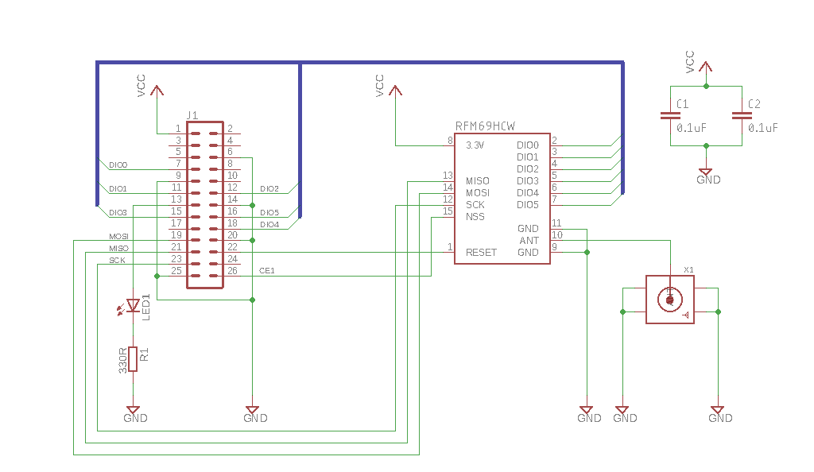

# HopeRF RFM69 Transceiver

The [Hope RFM69HW module](http://www.hoperf.com/rf_transceiver/modules/RFM69HW.html)
is an RF transceiver capable of receiving and transmitting signals using FSK
and OOK modulation. Ultimately it's a popular general purpose device for general
data transmission and integration with many cheap electronics which use either the
433MHz or 900MHz bands.

The module is mounted on a custom-made PCB which you'll have to construct. You can
manufacture a PCB from Aisler [here](https://aisler.net/p/MINCPAPN). Total cost
including components would cost about £12 / €14 / $14 per unit. This is the
bill of materials:

| Name  | Part               | Description |
| ----- | ------------------ | ---- |
| X1    |  SMA Connector     | Straight 50Ω PCB Mount Bulkhead Fitting SMA Connector, Solder Termination |
| U1    |  Hope RFM69HCW     | HopeRF RF Transceiver RFM69W-433-S2 433 MHz, 1.8 → 3.6V |
| R1    |  330Ω ±5% 0.25W    | Carbon Resistor, 0.25W, 5%, 330R |
| C1,C2 |  0.1uF             | Ceramic Decoupling Capacitors, 0.1uF |
| LED1  |  Generic LED       | LED, 5mm (T-1 3/4) Through Hole package |
| J1    |  26 Way PCB Header | 2.54mm Pitch 13x2 Rows Straight PCB Socket |

Here's the schematic:



In addition you'll want to purchase a 433Mhz antenna with an SMA connector which
will cost an extra couple of Euros, or you can simply solder a 50ohm 173mm wire if you
want to omit the expensive SMA connector. 

The pinouts for the module then correspond to the following physical and GPIO pins:

| RFM69 Pin | Physical | GPIO Pin | Description             |
| --------- | -------- | -------- | ----------------------- |
| MISO      |  21      | SPI_MISO | SPI Master In Slave Out |
| MOSI      |  19      | SPI_MOSI | SPI Master Out Slave In |
| SCK       |  23      | SPI_CLK  | SPI Clock               |
| NSS       |  26      | SPI_CE1  | SPI Chip Select CE1     |
| RESET     |  22      | GPIO25   | Module Reset            |
| DIO0      |   7      | GPIO4    | Data In Out 0           |
| DIO1      |  11      | GPIO17   | Data In Out 1           |
| DIO2      |  12      | GPIO18   | Data In Out 2           |
| DIO3      |  15      | GPIO22   | Data In Out 3           |
| DIO4      |  18      | GPIO24   | Data In Out 4           |
| DIO5      |  16      | GPIO23   | Data In Out 5           |

In addition there's a connection for an LED on physical pin 13,
which can be programmed to be GPIO17 or GPIO27 depending on the model
of Raspberry Pi you have.

Once you've constructed the PCB you can plug it in and communicate with
it on the SPI bus. In order to install and/or run the command-line tool, use the
following:

```
  bash% cd $GOPATH/src/github.com/djthorpe/sensors
  bash% go (run|install) cmd/rfm69.go
```

(more information on the module here shortly)

